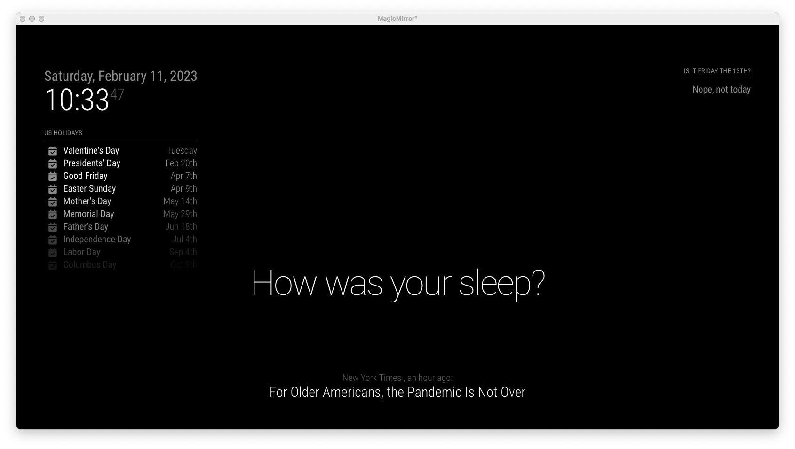
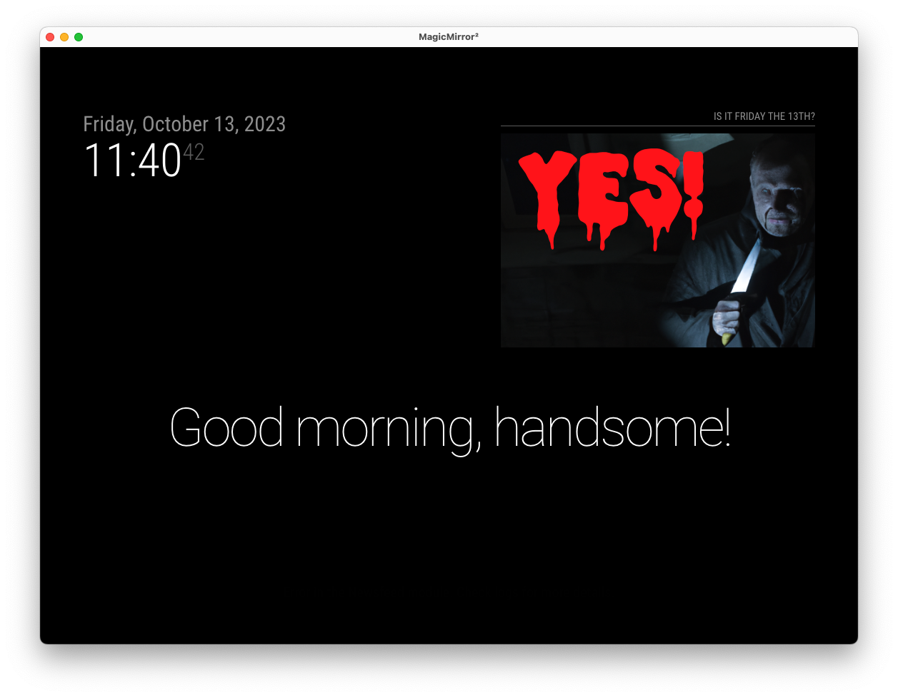

# MMM-friday-the-13th

A [MagicMirror](https://github.com/MichMich/MagicMirror) Module to show the user if today is Friday the 13th. By default this returns just a text string, but if you set the config option `scary` to `true` it will show a scary image instead!




## Requirements

This module is to be used with the [MagicMirror](https://github.com/MichMich/MagicMirror) project, so it assumes you have a working MagicMirror set up and running already. There is a great community for this project on places like [Reddit](https://www.reddit.com/r/MagicMirror/) and also the [MagicMirror Forums](https://forum.magicmirror.builders/) if you need help with getting started. There is also great [documentation](https://magicmirror.builders/) if you'd like to get started building your own module.

## Installation

1. Navigate into your MagicMirror's `modules` folder and execute `git clone https://github.com/leabs/MMM-friday-the-13th.git`
2. Navigate to your config file in `config/config.js` and add the module to the modules array like so:

```
modules: [
	...Other Modules Here...,
	{
		module: 'MMM-friday-the-13th',
		position: 'top_right',
		//Config option for scary mode. If you want to be scared, set this to true.
		config: {
			scary: false,
		}
	}
]
```

Inspired by [r/IsTodayFridayThe13th](https://www.reddit.com/r/IsTodayFridayThe13th).
